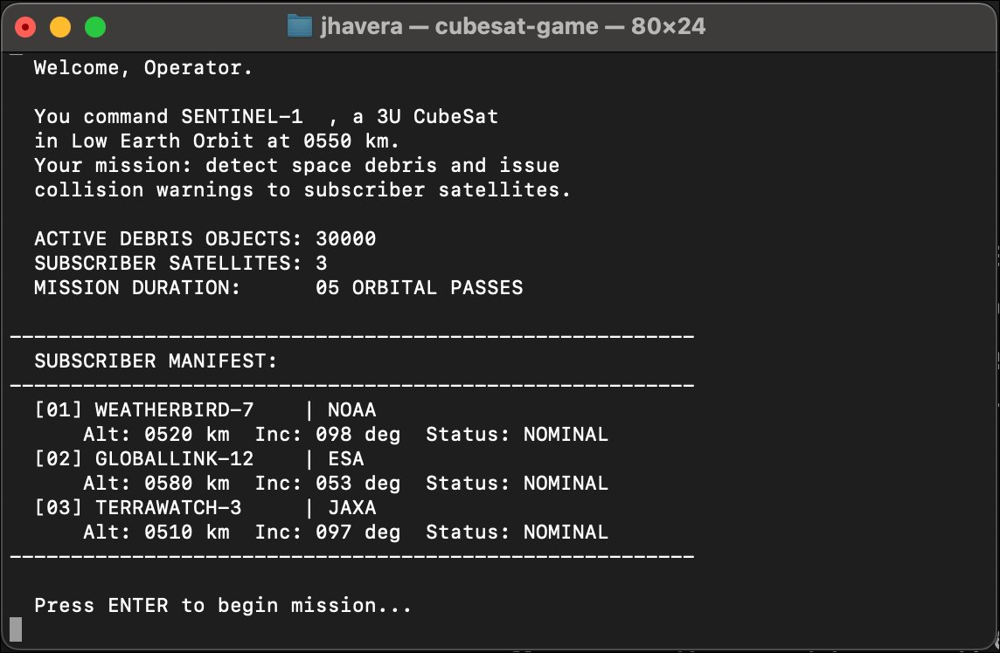
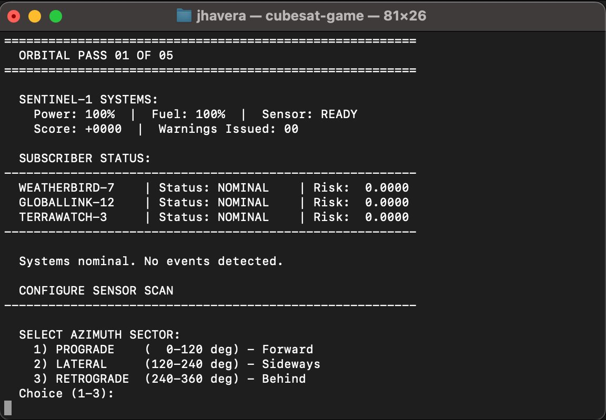
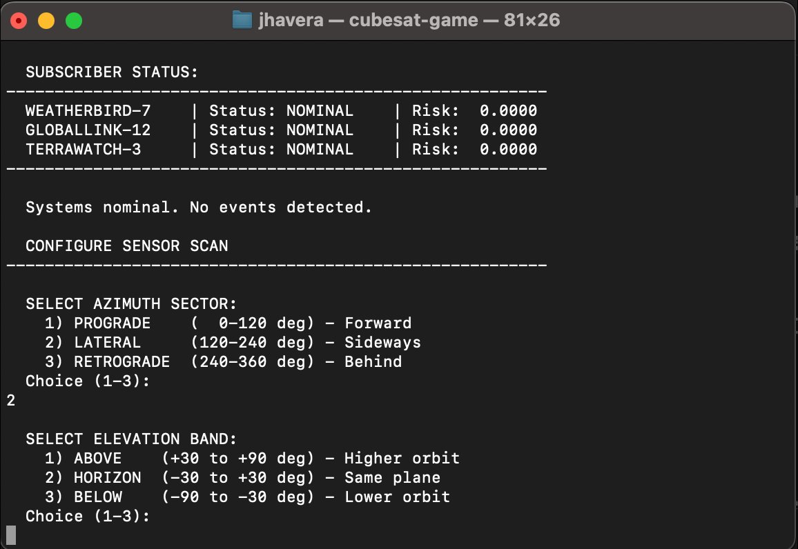
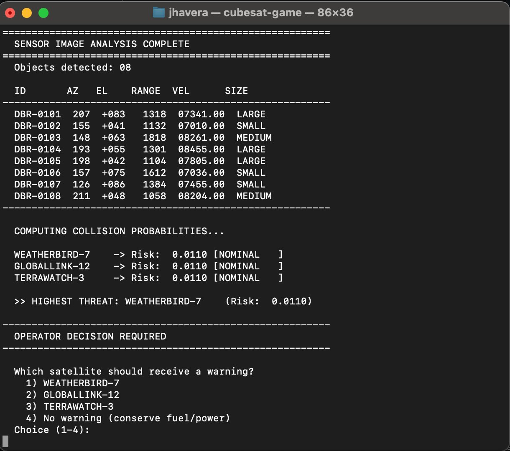
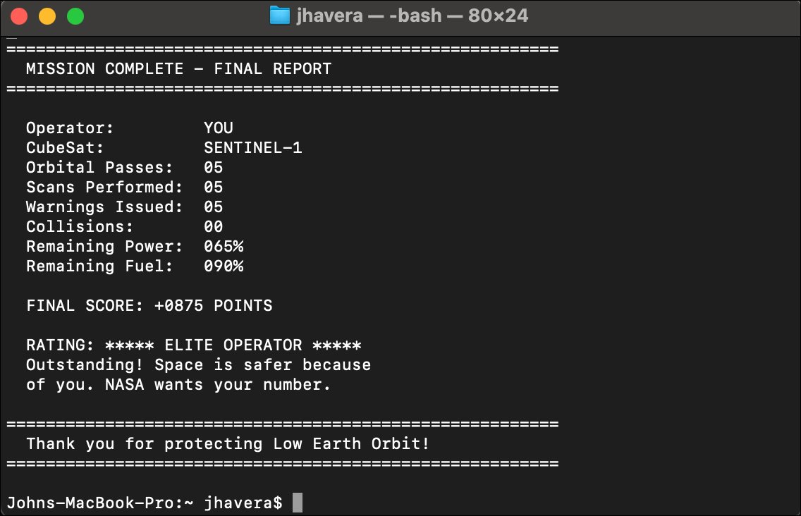

# CubeSat Debris Tracker

A turn-based space debris tracking game written in COBOL. You operate SENTINEL-1, a CubeSat in Low Earth Orbit, scanning for debris and issuing collision warnings to subscriber satellites. Built with GnuCOBOL to explore whether a 67-year-old language can still make programming fun.

Inspired by [Anthropic's Claude Code COBOL announcement](https://www.anthropic.com/research/cobol-code-modernization), classic text games like [Apple Trek](https://apple.fandom.com/wiki/Apple_II_Trek), and a weekend of nostalgia.



## Quick Start

### Prerequisites

**macOS:**
```bash
brew install gnucobol
```

**Ubuntu/Debian:**
```bash
sudo apt install gnucobol
```

**Windows (via MSYS2):**
```bash
pacman -S mingw-w64-x86_64-gnucobol
```

### Compile and Run

```bash
cobc -x -free -o cubesat-game cubesat-game.cob
./cubesat-game
```

### Run Online (No Install)

Paste the source code into [JDoodle's COBOL compiler](https://www.jdoodle.com/execute-cobol-online/). Enter your choices in the Stdin box, one per line. Note: clear-screen commands won't work in the web output panel.

## Gameplay

You command **SENTINEL-1**, a 3U CubeSat in Low Earth Orbit at 550 km, equipped with an optical debris sensor. Three satellites subscribe to your collision warning service. Over 5 orbital passes, you must detect threats and keep your subscribers safe.

### The Mission Loop

Each orbital pass follows this sequence:

1. **Status Check** — Review your power, fuel, sensor readiness, and subscriber satellite status
2. **Random Event** — Solar flares, ground station updates, or battery recharges may occur
3. **Configure Scan** — Choose your sensor's azimuth sector, elevation band, and range
4. **Analyze Results** — Review detected debris objects with position, velocity, and size data
5. **Assess Threats** — System computes collision probabilities for each subscriber satellite
6. **Issue Warning** — Choose which satellite to warn and recommend an avoidance maneuver
7. **Resolution** — See if your decision prevented a collision



### Scan Configuration

You control three scan parameters that determine where your sensor looks and how much power it costs:

**Azimuth Sector** (horizontal direction):
| Choice | Sector | Range | Description |
|--------|--------|-------|-------------|
| 1 | PROGRADE | 0-120° | Forward along orbit |
| 2 | LATERAL | 120-240° | Sideways |
| 3 | RETROGRADE | 240-360° | Behind |

**Elevation Band** (vertical angle):
| Choice | Band | Range | Description |
|--------|------|-------|-------------|
| 1 | ABOVE | +30° to +90° | Higher orbit objects |
| 2 | HORIZON | -30° to +30° | Same orbital plane (highest risk) |
| 3 | BELOW | -90° to -30° | Lower orbit objects |

**Range Band** (distance):
| Choice | Band | Range | Power Cost | Debris Detected |
|--------|------|-------|------------|-----------------|
| 1 | CLOSE | 100-500 km | 8% | 1-4 objects |
| 2 | MEDIUM | 500-1000 km | 5% | 2-7 objects |
| 3 | FAR | 1000-2000 km | 3% | 3-10 objects |

**Tip:** Scanning the HORIZON elevation band gives a risk multiplier because debris in the same orbital plane is most likely to intersect subscriber satellite paths.



### Debris Detection

Each scan detects debris objects with the following attributes:

| Field | Description |
|-------|-------------|
| ID | Unique identifier (e.g., DBR-0101) |
| AZ | Azimuth in degrees |
| EL | Elevation in degrees (signed) |
| RANGE | Distance in kilometers |
| VEL | Velocity in m/s (7000-8500 typical for LEO) |
| SIZE | SMALL, MEDIUM, or LARGE |

Size distribution: 50% small, 32% medium, 18% large. Larger debris has a higher collision risk multiplier.



### Collision Risk

The system computes collision probability for each subscriber satellite based on:

- **Proximity** — Closer debris = higher base risk (inverse of range)
- **Size** — Large debris gets a 3x multiplier, medium gets 1.5x
- **Orbital plane** — Scanning HORIZON band adds a bonus multiplier (same plane = higher real-world risk)
- **Randomization** — Each satellite gets slightly different risk per scan

Risk thresholds:
| Risk Level | Threshold | Status |
|------------|-----------|--------|
| CRITICAL | >= 0.5000 | Immediate danger |
| WARNING | >= 0.2000 | Elevated risk |
| NOMINAL | < 0.2000 | Acceptable |

### Scoring

| Outcome | Points | Description |
|---------|--------|-------------|
| Correct warning | +200 | Warned the satellite with highest collision probability |
| Wrong satellite (near miss) | +50 | Warned wrong satellite, highest-risk satellite had a close call |
| Wrong satellite (lucky) | +75 | Warned wrong satellite, but no collision occurred |
| No warning (collision) | -100 | Didn't warn anyone and debris hit a satellite |
| No warning (lucky) | +25 | Didn't warn anyone but nothing happened (resource conservation) |

### Final Ratings

| Score | Rating |
|-------|--------|
| 800+ | ★★★★★ ELITE OPERATOR |
| 500-799 | ★★★★ SKILLED OPERATOR |
| 200-499 | ★★★ CAPABLE OPERATOR |
| 0-199 | ★★ NOVICE OPERATOR |
| < 0 | ★ NEEDS IMPROVEMENT |



### Resource Management

**Power** (starts at 100%):
- Depleted by sensor scans (3-8% per scan depending on range)
- Depleted by solar flares (-5%)
- Recharged by sunlight (+10%)
- Below 15% triggers power-save mode (+15% emergency recovery)

**Fuel** (starts at 100%):
- Depleted by issuing warnings (-2% per warning transmitted)
- Below 10% triggers low fuel warning
- Cannot be replenished

### Random Events

Each turn, one of four events occurs:

| Probability | Event | Effect |
|-------------|-------|--------|
| 15% | Solar Flare | Power -5% |
| 10% | Ground Station Update | +47 objects added to debris catalog |
| 10% | Battery Recharge | Power +10% |
| 65% | Systems Nominal | No effect |

### Subscriber Satellites

| Satellite | Agency | Altitude | Inclination | Type |
|-----------|--------|----------|-------------|------|
| WEATHERBIRD-7 | NOAA | 520 km | 98° | Polar weather |
| GLOBALLINK-12 | ESA | 580 km | 53° | Communications |
| TERRAWATCH-3 | JAXA | 510 km | 97° | Earth observation |

Satellite positions drift between turns, simulating orbital motion.

## COBOL Features Demonstrated

This game was built as an educational project to showcase COBOL language features in a hands-on context:

**Data Structures:**
- Hierarchical record layouts with level numbers (01, 05, 10)
- `OCCURS` clauses for table/array definitions (satellite table, debris table)
- `PIC` clauses for typed fields (alphanumeric, numeric, signed, decimal)
- Level-88 condition names for readable state checks (`SAT-NOMINAL`, `SAT-CRITICAL`, `DEB-LARGE`)

**Control Flow:**
- `EVALUATE TRUE` for pattern matching (random events, scan choices, scoring)
- `PERFORM VARYING` for indexed loop iteration over tables
- `PERFORM paragraph-name` for structured procedural flow
- Nested `IF/ELSE IF/ELSE/END-IF` for decision logic

**Arithmetic:**
- `ADD`, `SUBTRACT`, `COMPUTE` for explicit, readable math
- `FUNCTION RANDOM` for procedural generation with seed initialization
- `FUNCTION INTEGER` and `FUNCTION MOD` for range calculations
- Fixed-point decimal arithmetic (`PIC 9V9(4)`) for collision probabilities

**I/O and System Integration:**
- `DISPLAY` and `ACCEPT` for interactive terminal I/O
- `CALL "SYSTEM"` for terminal clear-screen (macOS/Linux)
- `STRING ... DELIMITED BY SIZE` for dynamic ID generation
- `SIGN LEADING SEPARATE` for formatted score display

## Project Structure

```
cubesat-game.cob    — Complete game source (free format, ~765 lines)
README.md           — This file
screenshots/        — Terminal screenshots
  01-intro.png
  02-status.png
  03-scan-config.png
  04-scan-results.png
  05-game-over.png
```

## Platform Notes

| Platform | Clear Screen | Compile Command |
|----------|-------------|-----------------|
| macOS | `clear` (works) | `cobc -x -free -o cubesat-game cubesat-game.cob` |
| Linux | `clear` (works) | `cobc -x -free -o cubesat-game cubesat-game.cob` |
| Windows | Change to `cls` in source | `cobc -x -free -o cubesat-game.exe cubesat-game.cob` |
| JDoodle | No effect (web panel) | Paste source, select COBOL |

To switch to Windows, change line 4 of the WORKING-STORAGE SECTION:
```cobol
01 WS-CLEAR-CMD       PIC X(6) VALUE "cls".
```

## Background

This game was built after reading about Anthropic's Claude Code announcement for COBOL modernization, which triggered a 13% drop in IBM's stock price in February 2026. As an IBM alumnus and co-founder of xOrbita, a space debris detection company, I wanted to revisit the language I learned in college and see if it could still be fun to program in. The answer: yes, surprisingly so.

Read the full story: [LinkedIn article link]

## License

MIT License. Do whatever you want with it. If you build on it, I'd love to see what you make.

## Author

**[Your Name]** — Co-founder of [xOrbita](https://xorbita.com), IBM alumnus, and occasional COBOL nostalgist.
